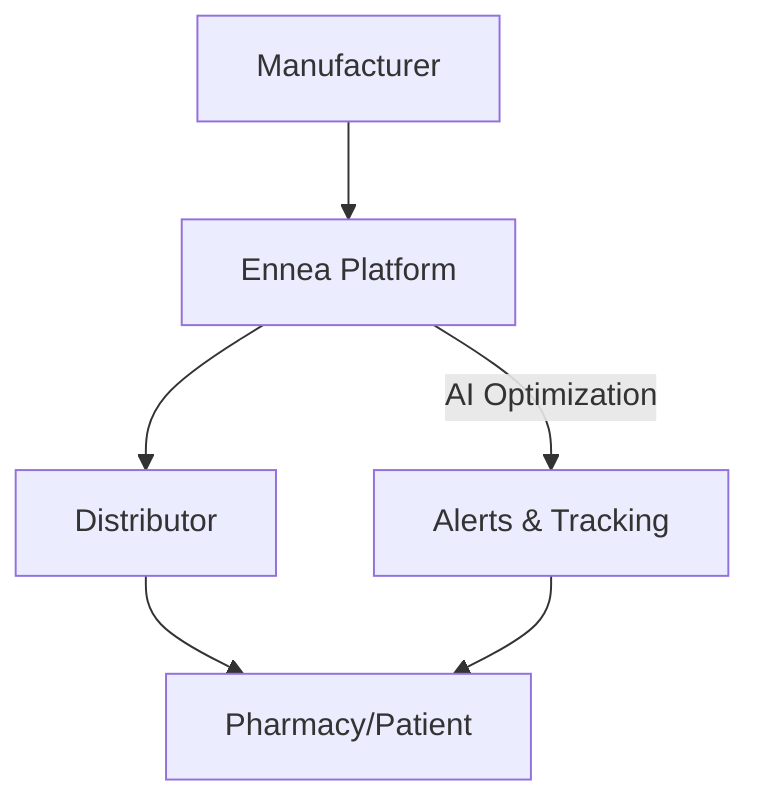

## Recent Releases

Stay updated with the latest enhancements in Ennea Solutions, your platform for streamlining pharmaceutical distribution. Review release notes below to understand new features, workflow improvements, and fixes that ensure efficient delivery of medications.

<Update label="2024-10-15" description="v1.2.0" tags={["feature", "improvement"]}>

## New Features

- Added real-time shipment tracking dashboard with GPS integration for monitoring life-saving medication deliveries.
- Introduced automated compliance checks for FDA regulations during distribution workflows.

## Improvements

- Enhanced inventory sync speed by 40%, reducing delays between manufacturers and pharmacies.
- Optimized API rate limits to support high-volume queries from enterprise users.

## Bug Fixes

- Fixed intermittent failures in batch processing for multi-site distributions.
- Resolved UI glitches in the mobile app when viewing order histories.

</Update>

<Update label="2024-09-20" description="v1.1.0" tags={["feature", "bugfix"]}>

## New Features

- Launched temperature monitoring alerts for cold-chain pharmaceuticals, ensuring product integrity.
- Integrated push notifications for urgent delivery updates to end customers.

## Bug Fixes

- Corrected data export errors in CSV reports for audit trails.
- Patched security vulnerability in user authentication endpoints.

## Performance

- Reduced dashboard load times by caching frequently accessed distribution metrics.

</Update>

<Update label="2024-08-10" description="v1.0.0" tags={["feature", "breaking"]}>

## Initial Release

- Core distribution workflow engine connecting manufacturers, distributors, and pharmacies.
- User authentication with role-based access for admins, logistics teams, and viewers.
- Basic reporting on delivery timelines and inventory levels.

## Breaking Changes

- Updated API versioning from `{v1}` to `{v1.0}` for better compatibility.

</Update>

## Upgrade to Latest Version

Follow these steps to upgrade your Ennea Solutions instance and benefit from the newest distribution optimizations.

<Steps>
  <Step title="Backup Data" icon="database">
    Export your current shipment and inventory data.

    <CodeGroup tabs="CLI,Docker">
      ```bash
      ennea-cli backup --output ./backups/shipments-$(date +%Y%m%d).json
      ```
      ```dockerfile
      docker run --rm -v $(pwd):/data ennea/backup:latest /data/shipments.json
      ```
    </CodeGroup>
  </Step>
  <Step title="Update Package" icon="package">
    Install the latest version via your package manager.
  </Step>
  <Step title="Run Migrations" icon="settings">
    Apply database schema changes for new compliance features.
  </Step>
  <Step title="Verify" icon="check-circle">
    Test shipment tracking in a staging environment.
  </Step>
</Steps>

<Callout kind="alert">
  Review breaking changes in v1.0.0 if upgrading from beta. Update your API calls to use the new `{version}` header.
</Callout>

## Platform-Specific Changes

<Tabs>
  <Tab title="Web Dashboard" icon="monitor">
    New responsive design supports tablet use for on-the-go logistics checks.
  </Tab>
  <Tab title="Mobile App" icon="smartphone">
    Added offline mode for viewing recent shipments without internet.
  </Tab>
  <Tab title="API" icon="code">
    <ParamField path="shipments/{id}/track" param-type="GET" required="true">
      Retrieve real-time location data.
    </ParamField>
  </Tab>
</Tabs>

## Upcoming Roadmap

Discover what's next for Ennea Solutions with these teased features to further streamline pharmaceutical distribution.

<Columns cols={3}>
  <Card title="AI Route Optimization" icon="zap" href="/features/ai-routing">
    Dynamically calculate fastest paths considering traffic and regulations.
  </Card>
  <Card title="Blockchain Traceability" icon="shield" href="/features/blockchain">
    Immutable audit trails from manufacturer to patient.
  </Card>
  <Card title="Global Expansion" icon="globe" href="/features/global">
    Multi-country support with localized compliance.
  </Card>
</Columns>

