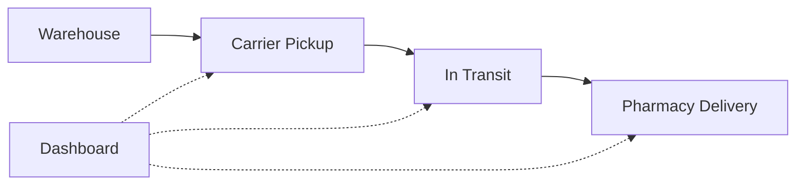

## Overview

Ennea Solutions delivers core features that streamline pharmaceutical distribution. You manage inventory, process orders, monitor deliveries in real time, and ensure compliance with regulations. These tools reduce delays and improve reliability for manufacturers, distributors, and pharmacies.

<Columns cols={2}>
  <Card title="Inventory Management" icon="package" href="/docs/inventory">
    Track stock levels and predict shortages with automated alerts.
  </Card>
  <Card title="Order Processing" icon="shopping-cart" href="/docs/orders">
    Automate fulfillment from order receipt to shipment.
  </Card>
  <Card title="Real-time Monitoring" icon="map-pin" href="/docs/tracking">
    Follow shipments live with GPS integration.
  </Card>
  <Card title="Compliance Tools" icon="shield" href="/docs/compliance">
    Meet FDA and global standards automatically.
  </Card>
</Columns>

## Inventory Management and Tracking

Maintain precise control over pharmaceutical stock. You receive automatic low-stock notifications and generate reports for audits. Integrate with your ERP system for seamless updates.

<CodeGroup tabs="JavaScript,Python">
  ```javascript
  const response = await fetch('/api/inventory/药品ID', {
    headers: { 'Authorization': 'Bearer your_token' }
  });
  const stock = await response.json();
  console.log(`Current stock: ${stock.quantity} units`);
  ```
  ```python
  import requests
  response = requests.get('/api/inventory/药品ID', headers={'Authorization': 'Bearer your_token'})
  stock = response.json()
  print(f"Current stock: {stock['quantity']} units")
  ```
</CodeGroup>

<Callout kind="tip">
  Set up webhooks for instant low-stock alerts to prevent disruptions.
</Callout>

## Order Processing and Fulfillment

Process orders efficiently with these steps. You confirm availability, pick items, and ship within minutes.

<Steps>
  <Step title="Receive Order" icon="inbox">
    Validate customer details and drug specifications.
  </Step>
  <Step title="Check Inventory" icon="package">
    Confirm stock and reserve items automatically.
  </Step>
  <Step title="Fulfill and Ship" icon="truck">
    Generate labels and hand off to carriers.
  </Step>
</Steps>

## Real-time Delivery Monitoring

Track shipments from warehouse to pharmacy. You view live locations and estimated arrival times on a dashboard.



## Compliance and Regulatory Tools

Ensure adherence to standards like FDA 21 CFR Part 11. You log all actions for traceability.

<Tabs>
  <Tab title="FDA Compliance" icon="shield">
    Automatic serialization and pedigree tracking.
  </Tab>
  <Tab title="EU FMD" icon="globe">
    Verify products against national databases.
  </Tab>
</Tabs>

<Expandable title="Advanced Integrations" default-open="false">

Connect with systems like SAP or Oracle for end-to-end compliance.

| System     | Integration Type |
|------------|------------------|
| SAP        | API + Webhooks   |
| Oracle     | Direct Database  |
| Custom ERP | REST Endpoints   |

</Expandable>

<Callout kind="alert">
  Always verify regulatory updates quarterly to stay compliant.
</Callout>