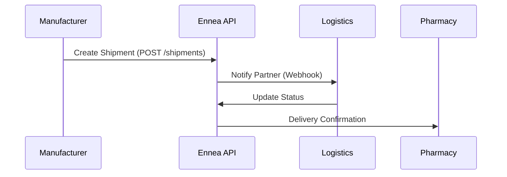

## Overview

Ennea Solutions integrates seamlessly with your existing pharmaceutical distribution tools. You connect via our RESTful API, partner with logistics providers, and sync data securely with ERP and CRM systems. These integrations streamline shipments from manufacturers to pharmacies, ensuring timely delivery of medications.

<Columns cols={3}>
  <Card title="API Connections" icon="zap" href="#api-connections">
    Build custom integrations using our secure API endpoints.
  </Card>
  <Card title="ERP & CRM" icon="database" href="#erp-crm">
    Sync inventory and customer data automatically.
  </Card>
  <Card title="Logistics Partners" icon="truck" href="#logistics">
    Partner with leading carriers for real-time tracking.
  </Card>
</Columns>

## API Connections for Manufacturers

Connect manufacturers directly to Ennea Solutions using our API. You authenticate with an API key and manage shipments programmatically.

<Callout kind="tip">
  Generate your API key from the [dashboard](https://dashboard.enneasolutions.com/api-keys).
</Callout>

### Authentication

Include your API key in the `Authorization` header.

<ParamField header="Authorization" param-type="string" required="true">
  Bearer `{YOUR_API_KEY}`
</ParamField>

### Create a Shipment

Use the `/v1/shipments` endpoint to initiate a new pharmaceutical shipment.

<CodeGroup tabs="JavaScript,Python,cURL">
  ```javascript
  const response = await fetch('https://api.enneasolutions.com/v1/shipments', {
    method: 'POST',
    headers: {
      'Authorization': 'Bearer YOUR_API_KEY',
      'Content-Type': 'application/json'
    },
    body: JSON.stringify({
      manufacturer_id: 'manf_12345',
      medication_name: 'Insulin Glargine',
      quantity: 100,
      destination_pharmacy: 'pharm_67890'
    })
  });
  const shipment = await response.json();
  ```
  ```python
  import requests

  headers = {
      'Authorization': 'Bearer YOUR_API_KEY',
      'Content-Type': 'application/json'
  }
  data = {
      'manufacturer_id': 'manf_12345',
      'medication_name': 'Insulin Glargine',
      'quantity': 100,
      'destination_pharmacy': 'pharm_67890'
  }
  response = requests.post('https://api.enneasolutions.com/v1/shipments', json=data, headers=headers)
  shipment = response.json()
  ```
  ```bash
  curl -X POST https://api.enneasolutions.com/v1/shipments \
    -H "Authorization: Bearer YOUR_API_KEY" \
    -H "Content-Type: application/json" \
    -d '{
      "manufacturer_id": "manf_12345",
      "medication_name": "Insulin Glargine",
      "quantity": 100,
      "destination_pharmacy": "pharm_67890"
    }'
  ```
</CodeGroup>

<ResponseField name="shipment_id" field-type="string" required="true">
  Unique shipment identifier, e.g., `ship_abc123`.
</ResponseField>

<ResponseField name="status" field-type="string">
  Current status: `pending`, `in_transit`, `delivered`.
</ResponseField>

## ERP and CRM Integrations

Sync your ERP or CRM with Ennea Solutions for automated inventory and order management.

<Tabs>
  <Tab title="SAP ERP" icon="database">
    <Steps>
      <Step title="Configure Webhook" icon="settings">
        Set up a webhook in SAP to POST to `https://api.enneasolutions.com/v1/webhooks/erp-sync`.
      </Step>
      <Step title="Map Fields">
        Map `material_code` to `manufacturer_id` and `customer_id` to `pharmacy_id`.
      </Step>
      <Step title="Test Sync">
        Trigger a test order and verify data in your Ennea dashboard.
      </Step>
    </Steps>
  </Tab>
  <Tab title="Salesforce CRM" icon="users">
    Use Zapier or our Salesforce AppExchange connector.
    
    ```javascript
    // Example Salesforce Apex trigger
    HttpRequest req = new HttpRequest();
    req.setEndpoint('https://api.enneasolutions.com/v1/orders');
    req.setMethod('POST');
    req.setHeader('Authorization', 'Bearer YOUR_API_KEY');
    // Add order data
    ```
  </Tab>
</Tabs>

## Logistics Provider Partnerships

Partner with certified logistics providers for compliant pharmaceutical shipping.

<Columns cols={2}>
  <Card title="FedEx" icon="truck" href="https://fedex.com/partners" target="_blank">
    Real-time tracking with temperature-controlled options.
  </Card>
  <Card title="UPS Healthcare" icon="package" href="https://ups.com/healthcare" target="_blank">
    Specialized cold chain logistics for vaccines and biologics.
  </Card>
</Columns>

## Data Sharing and Security Protocols

You share only necessary data via encrypted channels. All integrations use HTTPS and comply with HIPAA and GDPR.

<Expandable title="Security Best Practices" default-open="false">

Enable webhook signatures to verify payloads:

```
X-Ennea-Signature: v1.{hmac_sha256_signature}
```

Validate signatures using your shared secret.

</Expandable>



These integrations reduce delivery times by up to 40% while maintaining chain-of-custody compliance. Start by generating your API key today.