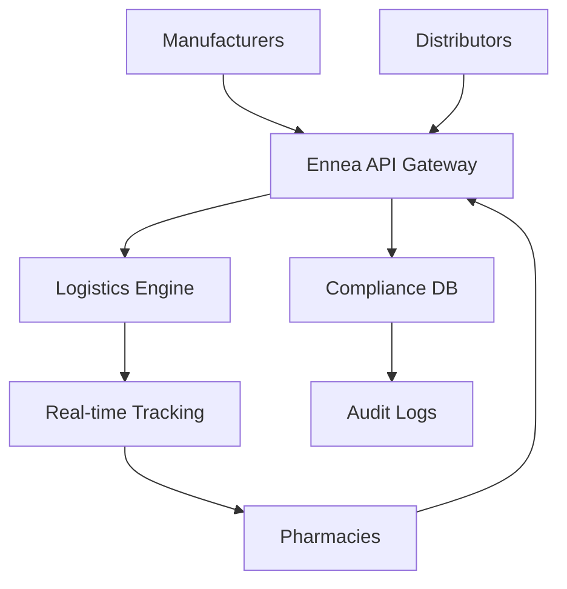

## Overview

Ennea Solutions empowers pharmaceutical companies to optimize their distribution chains. You streamline the process from manufacturers to pharmacies and hospitals, ensuring life-saving medications reach patients on time. Our mission focuses on efficiency, reducing delays that impact healthcare outcomes. We bridge gaps with real-time tracking, automated logistics, and seamless integrations.

<Callout kind="info">
Ennea Solutions prioritizes compliance with regulations like FDA guidelines and HIPAA for secure data handling.
</Callout>

## Key Benefits

Discover how Ennea Solutions transforms pharmaceutical distribution for various stakeholders.

<Columns cols={3}>
  <Card title="Manufacturers" icon="factory" href="/docs/manufacturers">
    Gain visibility into inventory and shipments. Reduce stockouts by `>30%` with predictive analytics.
  </Card>
  <Card title="Distributors" icon="truck" href="/docs/distributors">
    Automate routing and compliance checks. Cut delivery times in half.
  </Card>
  <Card title="Pharmacies" icon="package" href="/docs/pharmacies">
    Receive real-time updates and reorder seamlessly. Ensure `99.9%` on-time deliveries.
  </Card>
</Columns>

## Platform Architecture

Ennea Solutions uses a modular architecture for scalability and reliability.



<Expandable title="Advanced Architecture Details" default-open="false">

The platform leverages microservices deployed on Kubernetes. Key components include:

- **API Gateway**: Handles authentication with JWT tokens.
- **Logistics Engine**: Optimizes routes using AI algorithms.
- **Databases**: PostgreSQL for transactions, Redis for caching.

</Expandable>

## Stakeholder Views

Tailor your experience based on your role.

<Tabs>
  <Tab title="Manufacturer" icon="factory">
    Monitor production to delivery pipelines.
    
    ```javascript
    const shipment = await ennea.trackShipment('SHIP-12345');
    console.log(shipment.status); // 'in-transit'
    ```
  </Tab>
  <Tab title="Distributor" icon="truck">
    Manage fleets and routes dynamically.
    
    ```python
    shipment = ennea_client.track_shipment("SHIP-12345")
    print(shipment.status)  # 'in-transit'
    ```
  </Tab>
  <Tab title="Pharmacy" icon="package">
    Check incoming orders and ETAs.
    
    ```bash
    curl -H "Authorization: Bearer {TOKEN}" \
      https://api.enneasolutions.com/v1/shipments/SHIP-12345
    ```
  </Tab>
</Tabs>

## Get Started

Follow these steps to integrate Ennea Solutions into your workflow.

<Steps>
  <Step title="Sign Up" icon="user-plus">
    Create your account at [app.enneasolutions.com](https://app.enneasolutions.com).
  </Step>
  <Step title="Get API Key" icon="key">
    Navigate to Settings > API Keys and generate a new key.
  </Step>
  <Step title="Integrate SDK" icon="code">
    Install the SDK for your language.
    
    <CodeGroup tabs="npm,yarn,pip">
      ```bash
      npm install @ennea/sdk
      ```
      ```bash
      yarn add @ennea/sdk
      ```
      ```bash
      pip install ennea-sdk
      ```
    </CodeGroup>
  </Step>
  <Step title="Track First Shipment" icon="package">
    Use the SDK to track a test shipment.
    
    ```javascript
    import { Ennea } from '@ennea/sdk';
    
    const ennea = new Ennea({ apiKey: 'your-api-key' });
    const status = await ennea.trackShipment('TEST-SHIP-001');
    console.log(status); // { id: 'TEST-SHIP-001', status: 'ready' }
    ```
  </Step>
</Steps>

<Callout kind="tip">
Explore our [API Reference](/docs/api) for full endpoint details and [Quickstart Guides](/docs/quickstart) tailored to your role.
</Callout>