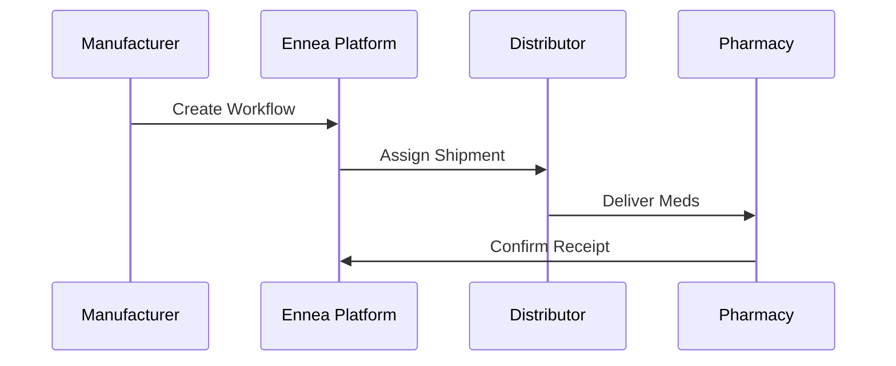

## Overview

Ennea Solutions streamlines pharmaceutical distribution by connecting manufacturers, distributors, and pharmacies. You can set up your account, configure the platform, explore the dashboard, and launch your first workflow in under 10 minutes. This guide walks you through each step.

<Callout kind="tip">
  Prepare your company details, such as FDA registration number and primary contact email, before starting.
</Callout>

## Create Your Account

Follow these steps to sign up and log in.

<Steps>
  <Step title="Visit the Platform" icon="globe">
    Navigate to the Ennea Solutions login page at `https://platform.enneasolutions.com`.
  </Step>
  <Step title="Sign Up" icon="user-plus">
    Click **Sign Up**. Enter your email, company name (e.g., "MediPharm Distributors"), and create a secure password.
  </Step>
  <Step title="Verify Email" icon="mail">
    Check your inbox for a verification link from `noreply@enneasolutions.com` and click it.
  </Step>
  <Step title="Log In" icon="log-in">
    Return to the login page and sign in with your credentials.
  </Step>
</Steps>

## Initial Platform Configuration

Configure your profile based on your role in the supply chain. Use the tabs below for role-specific settings.

<Tabs>
  <Tab title="Manufacturer" icon="factory">
    Enter your production details:

    ```json
    {
      "fdaRegistration": "12345678",
      "facilityAddress": "123 Industrial Blvd, Pharma City, CA 90210",
      "products": ["Insulin GL-10", "Vaccine Z-200"]
    }
    ```

    Save in the **Profile > Manufacturer** section.
  </Tab>
  <Tab title="Distributor" icon="truck">
    Set up logistics preferences:

    ```json
    {
      "warehouseId": "WH-456",
      "deliveryRadiusKm": 500,
      "preferredCarriers": ["FedEx Pharma", "UPS ColdChain"]
    }
    ```

    Update under **Profile > Distributor**.
  </Tab>
  <Tab title="Pharmacy" icon="building-2">
    Input receiving details:

    ```json
    {
      "npiNumber": "1234567890",
      "storageCapacity": "500 units",
      "emergencyContact": "+1-555-0123"
    }
    ```

    Configure in **Profile > Pharmacy**.
  </Tab>
</Tabs>

## Dashboard Tour

The dashboard provides key insights at a glance. Explore these main sections:

<Columns cols={3}>
  <Card title="Orders" icon="package" href="/docs/orders">
    View incoming and outgoing shipments for drugs like Insulin GL-10.
  </Card>
  <Card title="Inventory" icon="database" href="/docs/inventory">
    Track stock levels across your facilities.
  </Card>
  <Card title="Analytics" icon="bar-chart-3" href="/docs/analytics">
    Monitor delivery times and compliance metrics.
  </Card>
</Columns>

## Set Up Your First Distribution Workflow

Launch a test workflow to ship sample medications.

<Steps>
  <Step title="Create Workflow" icon="settings">
    Go to **Workflows > New**. Select **Distribution** template.
  </Step>
  <Step title="Add Products" icon="plus">
    Include items:

    ````javascript
    const workflowItems = [
      { sku: "INS-GL10-100U", quantity: 50, lot: "LOT2024A" },
      { sku: "VAC-Z200-5ML", quantity: 20, lot: "LOT2024B" }
    ];
    ````

    Paste into the product selector.
  </Step>
  <Step title="Assign Recipient" icon="users">
    Search for a pharmacy by NPI (e.g., "1234567890") and select.
  </Step>
  <Step title="Review and Activate" icon="check-circle">
    Verify details and click **Activate Workflow**.
  </Step>
</Steps>



<Callout kind="success">
  Your first workflow is live! Monitor progress in the **Dashboard > Active Workflows**.
</Callout>

<Expandable title="Next Steps" default-open="true">
  - Integrate with your ERP via API (see `/docs/api`).
  - Set up automated alerts for low stock.
  - Review compliance reports weekly.
</Expandable>